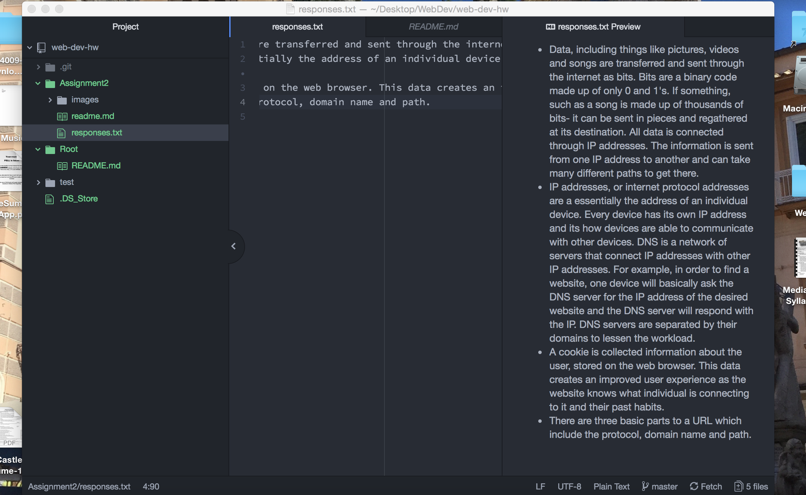

# Assignment 2

A version control system is essentially a way to continually update and change the project whilst very effectively tracking the changes and having the ability to return back to the pre-change version very easily. This version control system is a really effective way for beginners to learn. The collaborative aspect to the version control system is also beneficial for this type of platform. Multiple people can be collaborating and working on one project but nothing is changing the original until is is decided to officially alter it. Thus multiple people can work on the same project without overlapping or implementing mistakes onto the original project. The ability to track changes stands out as a prominent benefit of this system, especially for a classroom setting.

Here are a few [responses](./responses.txt) referring to the communication and inner workings of data movement.

This particular assignment was not necessarily extremely challenging but did require a tremendous amount of focus. I am new to web development and am a bit cautious going into it but thus far, it hasn't been too much to handle. These are a few things I kept trying to remember to do often.
* Save on Atom.
* Comment and commit on Github desktop.
* Push to Github.com.

These are easy steps but for some reason seem tedious when working on an assignment. I am a bit confused about how often and at what points these steps are supposed to be taken.

During this assignment I set up a directory system for assignment 2, created txt files as well as md files and added links and images. I decided to save, commit and push a couple times during the assignment to insure everything was saved and also check the progress and verify I was completing each step correctly.

