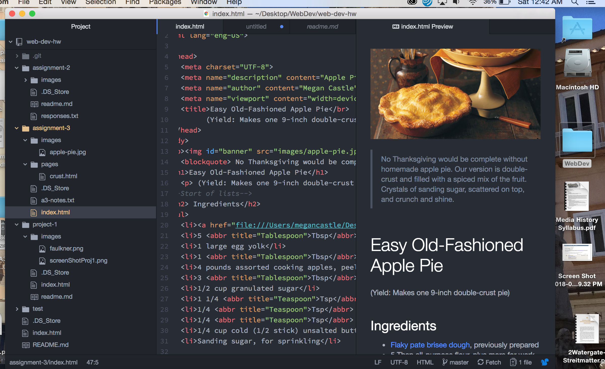

# Technical Report for Assignment 3

There should only be one head and one body element per webpage. There could potentially be more but the web browsers might struggle displaying it properly. The head elements contain the logistical information of a website. The head includes things like the viewport, a description and the author information of the webpage. The head essentially includes all of the meta data. The body element includes all of the content of the page. Contrary to the majority of the head elements, the body elements are visible to the viewers.

Semantic markup is not meant to physically alter the appearance of the website. Semantic markup makes changes so that web browsers can locate the page or read it differently. It essentially helps describe the page. Structural markup changes the actual structure and visual of the webpage. Structural markup includes things like headings, paragraphs, lists and breaks.

I noticed in this assignment that I struggle more with figuring out and coding links than anything else. Even though it seems very intuitive because it is such an organized system but for some reason it seems difficult for me to figure it out as every little finite detail needs to be perfect for it to function. For the other elements in the assignment I had to consistently check the book and had the tutorial on the website open to look at, to make sure I was getting the elements exactly correct but it didn't pose too many issues.

