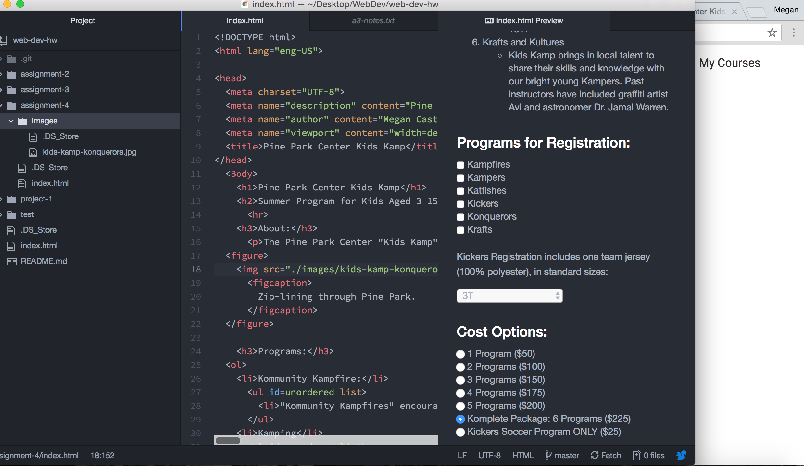

# Read me for assignment 4
Alt text is a way to describe the image on the webpage without being able to see it. It is used for visually impaired users. Without being able to see or decipher the image-- the alt text allows for an alternative form of describing the image.

Forms are used in arguably most web pages. I would say potentially the most common use of a form is a login page. A log in page is essential for basically all web pages now including email, credit card sites, bank accounts and even social media. even for school! Other types of forms include things like subscription entries, surveys, log ins and any type of participatory element to a webpage.

This assignment was difficult for me structure wise-- the modules made the logistics of the coding fairly manageable but after I completed all the requirements and looked at the live site, I had to adjust a lot of things. Page breaks seemed to be a struggle for this project. My forms worked but they weren't placed properly. I went back through and organized my codes and made sure everything was in the right place. I have also noticed that I'm a bit confused on how to properly structure the codes-- I might have a "rude code" but I tried to figure out how to not!

