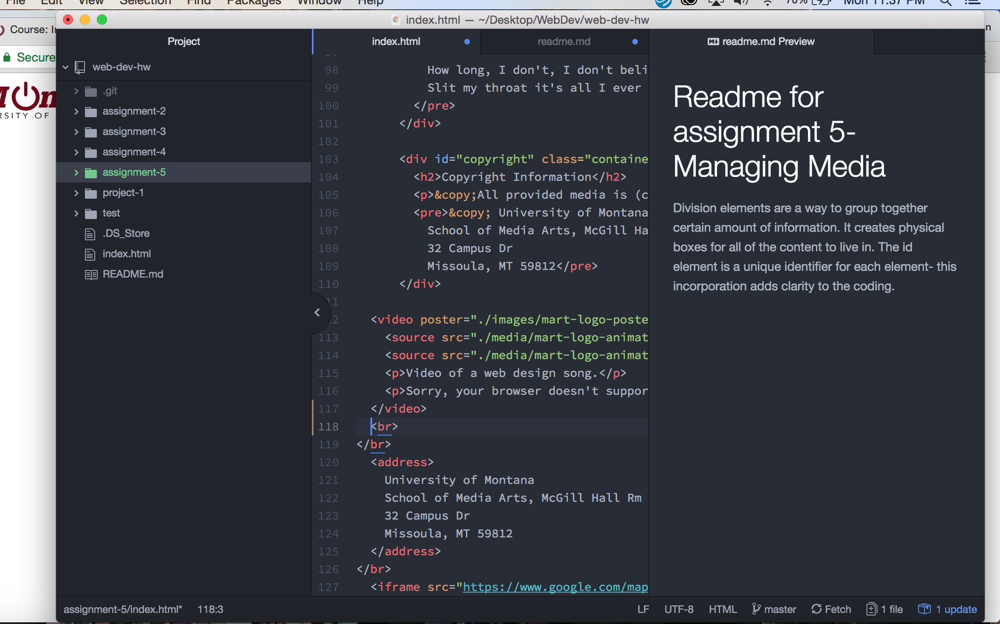

# Readme for assignment 5- Managing Media
Division elements are a way to group together certain amount of information. It creates physical boxes for all of the content to live in. The id element is a unique identifier for each element- this incorporation adds clarity to the coding. The class system groups similar categories of elements together. The span element is essentially the same as the div but it does not create a physical block, just helps group the coding. All of these elements help to create clarity and organization.

One valuable reason to choose third-party hosting versus self-hosting is that the sites that are being used to host third-party will insure that the site will work over multiple browsers. The third-party site has a vested interest that the content being hosted through their servers is available to all of their users.

This assignment was fairly straightforward. The only difficulty I found was attempting to embed a map of the university. I finally realized that because I was signed into a gmail account it was created a map of my saved places which would not show on the site-- it just embedded a map of the world. As soon as I signed out of my account and re copied the link, it worked fine. The other aspects of this assignment were pretty reasonable. It is sort of amazing how easy it is to take videos and audio from sites like Youtube and Soundcloud. The embed link is very helpful.

