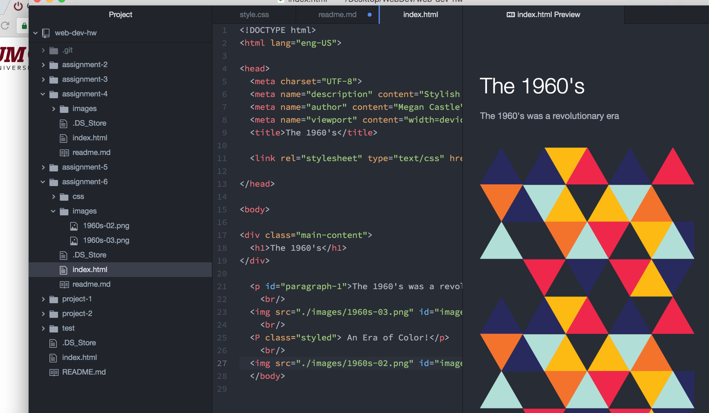

# Technical Report for Assignment 6

I chose the 1960's because I liked the diversity of colors without the added eccentric fashion present in the 70's, 80's and 90's. The colors in the 60's are vibrant and contradicting. I used overlapping elements to show the collaboration of colors.I also used graphics that had both natural shapes and geometric shapes to show the diversity of the designs of the era.

I chose to include more than three colors but my most prominent colors are #28295D, #FCBA12 and #B1DFD8. These are all vibrant colors and surprisingly look very cool and energetic together.

I struggled with assignment far more than I anticipated. This was in fact, probably one of the hardest assignments for me. I had a tough time figuring out how to structure the html knowing I would be styling. I ended up starting from scratch a couple of times. I just kept referring to the website and text book to decipher each step.

