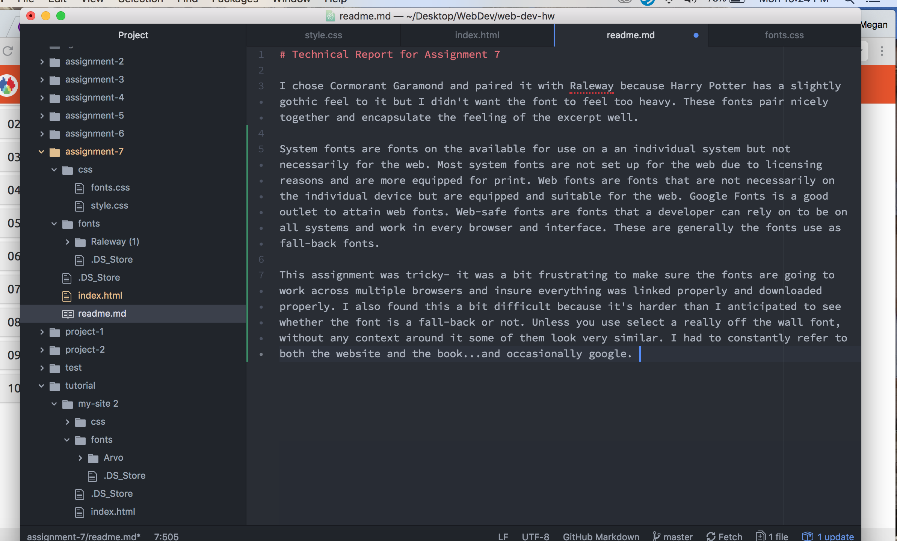

# Technical Report for Assignment 7

I chose Cormorant Garamond and paired it with Raleway because Harry Potter has a slightly gothic feel to it but I didn't want the font to feel too heavy. These fonts pair nicely together and encapsulate the feeling of the excerpt well.

System fonts are fonts on the available for use on a an individual system but not necessarily for the web. Most system fonts are not set up for the web due to licensing reasons and are more equipped for print. Web fonts are fonts that are not necessarily on the individual device but are equipped and suitable for the web. Google Fonts is a good outlet to attain web fonts. Web-safe fonts are fonts that a developer can rely on to be on all systems and work in every browser and interface. These are generally the fonts use as fall-back fonts.

This assignment was tricky- it was a bit frustrating to make sure the fonts are going to work across multiple browsers and insure everything was linked properly and downloaded properly. I also found this a bit difficult because it's harder than I anticipated to see whether the font is a fall-back or not. Unless you use select a really off the wall font, without any context around it some of them look very similar. I had to constantly refer to both the website and the book...and occasionally google.

