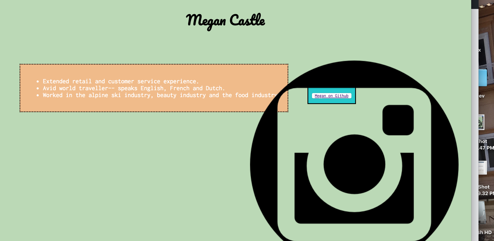

# Technical report for assignment 8

Padding is a defining word for the space between the content and the border. A border is a stylized line around the content or around the main container. The margin is the space on the outside of the content border.

Overlapping elements was pretty tricky. It's hard to decide what elements to overlap and how their overlap will be aesthetically pleasing. I found it difficult to figure out what placement to give each overlapping element to accommodate for the changing size of a browser.

This assignment came easier than I originally thought it might. Now having some prior knowledge of coding made it sort of fun to put a site together and actually be able to style it and put elements in different positions. The placement was a little hard for me but I referred back to the module and studied both the html and css code and was able to figure it out.

