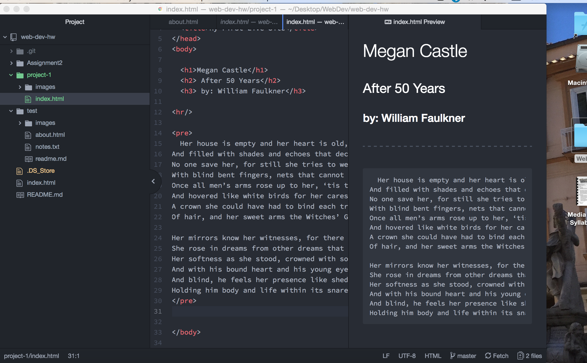

# Project 1
## Megan Castle
I primarily use Chrome on my computer to surf the web. I have an I-phone which defaults to using safari so I also use safari on my mobile device. Modern web browsers function by processing html and Javascript code and then rendering these codes into websites. There are various types of interpreters used by different browsers to help understand different codes. This is why the same website can look different on different browsers. These different rendering engines can make web development tricky as the developer needs to insure their site will function on multiple browsers.

The Wayback Machine was very fun to play around with. I visited the New York Times website from the year I was born- 1998. I visit this website fairly frequently now and I thought it would be interesting to see how much it has changed just in my lifetime. The most noticeable attribute that has changed is user interface and just simply the aesthetics of the site. There is essentially no images besides the logo and the search abilities seem far more limited. Things have definitely changed!

This project was actually very exciting for me! Its cool to realize that I have actually coded and created a live website. It may be simple, but it exists and I built it from scratch! Nothing in this assignment was extremely difficult for me. I had to go back and review how to link my live site again but after I went through the steps on the class site I did without too much trouble. The only part of this assignment I found a little tricky was finding an image that was under 300px. I'm not entirely sure how to search for small images on the web. I posted this question to the issues board on Github so hopefully I will receive some tips! In this assignment I...
- Created my directory system for project 1
- Created my website using html
- Defined my link for the live site

