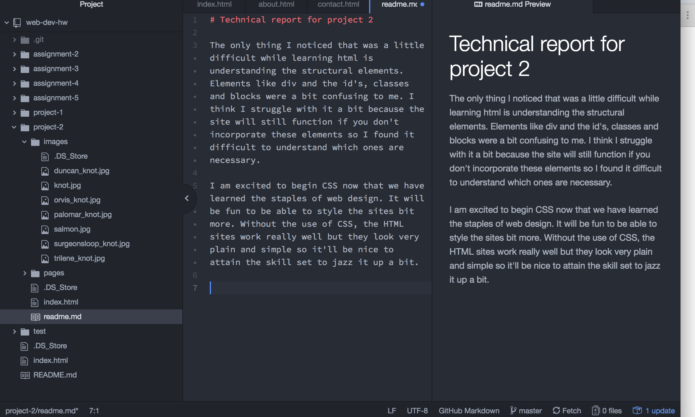

# Technical report for project 2

The only thing I noticed that was a little difficult while learning html is understanding the structural elements. Elements like div and the id's, classes and blocks were a bit confusing to me. I think I struggle with it a bit because the site will still function if you don't incorporate these elements so I found it difficult to understand which ones are necessary.

I am excited to begin CSS now that we have learned the staples of web design. It will be fun to be able to style the sites bit more. Without the use of CSS, the HTML sites work really well but they look very plain and simple so it'll be nice to attain the skill set to jazz it up a bit.

This assignment was slightly more difficult to keep organized. With the three pages, it really felt like three assignments so I had to focus on keeping them collaborative. Some of the specific HTML markup and things I needed a refresher so I took a quick look back at some of our earlier modules.

